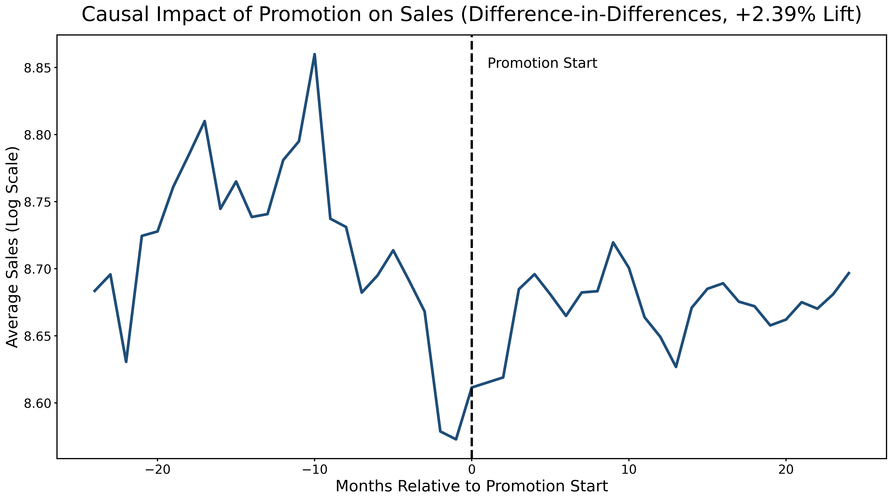
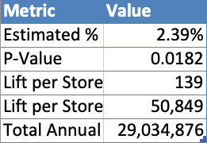

# Estimating the Causal Impact of Retail Promotions (Difference-in-Differences)

## Project Overview

This project estimates the causal impact of Rossmann’s long-term promotion program (Promo2) on daily store sales using a Difference-in-Differences (DiD) approach.

The goal is to determine whether promotions actually increase sales, or if observed changes are driven by external factors such as seasonality or trends.

---

## Business Problem

Rossmann operates over 1,000 retail stores and runs long-term promotional campaigns. Management wants to understand whether Promo2 generates real revenue lift or if sales would have increased regardless.

---

## Methodology

- Merged daily sales data with store-level characteristics  
- Identified treated stores (Promo2 participants) and control stores  
- Constructed promotion start dates using Promo2 timing variables  
- Built treatment (Treated), post (Post), and interaction (DiD) variables  
- Estimated causal impact using a Difference-in-Differences model with:
  - Store fixed effects  
  - Date fixed effects  
- Conducted event study analysis to evaluate parallel trends  

---

## Event Study Visualization

The chart below shows average log sales before and after promotion adoption.

---

## Key Results

- **Estimated sales lift:** +2.39% (statistically significant, p = 0.018)  
- **Lift per store per day:** ~$139  
- **Lift per store per year:** ~$50,849  
- **Total annual impact:** ~$29M across 571 treated stores  

---

## Business Impact Summary

---

## Interpretation & Limitations

- Promo2 is associated with a meaningful increase in sales  
- However, event study results suggest possible non-random adoption timing  
- Results should be interpreted as strong evidence of positive impact, but not perfectly causal  

---

## Recommendations

- Evaluate promotion profitability (revenue vs cost)  
- Consider controlled rollout strategies for future promotions  
- Use causal methods to guide marketing and pricing decisions  

---

## Tools Used

- Python (pandas, numpy)  
- linearmodels (PanelOLS)  
- Matplotlib  
- Google Colab  

---

## Data Source

Rossmann Store Sales dataset (Kaggle):  
https://www.kaggle.com/c/rossmann-store-sales

---

## Key Skills Demonstrated

- Causal inference (Difference-in-Differences)  
- Panel data modeling  
- Feature engineering for treatment effects  
- Business impact translation  
- Data cleaning and preprocessing  
